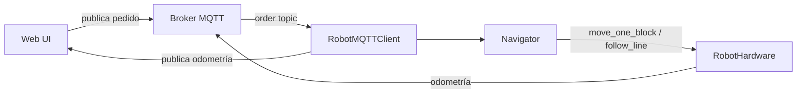

# Memoria del proyecto : Robot de reparto EV3

---

## 1. Introducción

El proyecto consiste en desarrollar un robot de reparto basado en la plataforma LEGO EV3 que, mediante un algoritmo de planificación y seguimiento de línea, es capaz de recibir pedidos desde una aplicación web, navegar por una ciudad simulada, recoger y entregar paquetes.  El robot se comunica con el broker MQTT **inteligenciaambientaluja.cloud.shiftr.io** para intercambiar órdenes y publicar su estado (odometría, posición, errores).  La versión actual **funciona correctamente** probándose en una pista de pruebas y en simulaciones de la ciudad.

*(Este apartado puede actualizarse con los últimos experimentos o cambios de alcance.)*

---

## 2. Objetivos

1. **Funcionalidad completa**: recibir pedidos, navegar al punto de recogida, recoger el paquete y entregarlo en la ubicación solicitada.
2. **Comunicación fiable**: usar MQTT para transmitir órdenes y telemetría en tiempo real.
3. **Modularidad**: separar la lógica de hardware, de planificación y de comunicación para facilitar la reutilización.
4. **Robustez**: manejo de pérdidas de conexión, reintentos y diagnóstico visual mediante la pantalla del robot.
5. **Escalabilidad**: permitir la extensión a más robots y a nuevas categorías de competencia (A/B/C).

---

## 3. Requisitos

| Tipo | Descripción |
|------|-------------|
| **Hardware** | LEGO EV3, sensor de colour (para línea verde), motor de pala, pantalla, botones, giroscopio, motor de ruedas. |
| **Software** | Python‑MicroPython para EV3, librerías `pybricks`, script `main.py`, `navigation.py`, `map_parser.py`, `mqtt_client.py`. |
| **Red** | Broker MQTT con TLS, tópico `A3-467/...` para mapa, órdenes y odometría. |
| **Entorno** | PC con Python 3.10+, `paho‑mqtt`, `pandas` (análisis), `svg` para diagramas. |
| **Rendimiento** | Publicar odometría ≥ 1 Hz, tiempo de respuesta a una orden ≤ 2 s. |

---

## 4. Arquitectura


La arquitectura está compuesta por:
- **Broker MQTT** (cloud Shiftr) que distribuye el mapa, órdenes y recoge la telemetría.
- **Módulo de hardware** (`RobotHardware`) que abstrae motores, sensores y pantalla.
- **Parser de mapa** (`CityMap`) que convierte la cadena recibida en una cuadrícula navegable.
- **Navegador** (`Navigator`) que calcula la ruta óptima (BFS) y ejecuta los movimientos (bloque a bloque o seguimiento de línea).
- **Interfaz web** (`webapp`) donde el usuario crea pedidos y visualiza el estado del robot.
- **Cliente MQTT** (`RobotMQTTClient`) que conecta, suscribe y publica en los tópicos apropiados.

---

## 5. Planificación

| Sprint | Tareas principales | Entregable |
|--------|-------------------|------------|
| **1** | Configuración del hardware, pruebas de sensores. | Demo de movimiento básico. |
| **2** | Implementación del broker MQTT y pruebas de conexión. | Envío/recepción de mapa y órdenes. |
| **3** | Algoritmo de planificación (BFS) y navegación bloque a bloque. | Robot alcanza coordenadas indicadas. |
| **4** | Integración de seguimiento de línea (categoría C). | Navegación por trazado verde. |
| **5** | Interfaz web y despliegue en Docker. | Aplicación accesible desde PC. |
| **6** | Tests de rendimiento, documentación y generación de PDF. | Memoria completa y video‑demo. |

---

## 6. Diseño

### 6.1 Diagrama de componentes
*(Se incluye el diagrama de arquitectura anterior; cada bloque está conectado mediante los tópicos MQTT.)*

### 6.2 Flujo de un pedido


### 6.3 Algoritmo de planificación
- Se usa **BFS** sobre la cuadrícula (`CityMap.get_neighbors`).
- La ruta resultante se transforma a una lista de direcciones (UP, DOWN, LEFT, RIGHT).
- El `Navigator` gira al ángulo correcto y avanza un bloque, usando `follow_line_to_next_block` cuando la categoría C está activada.

### 6.4 Control de línea verde
- Sensor de color → cálculo de *greenness* (`g - max(r,b)`).
- Umbral `LINE_THRESHOLD` determina si está sobre la línea.
- Control PD con ganancias `PROPORTIONAL_GAIN` y `DERIVATIVE_GAIN`.
- Máquina de estados para detectar la frontera negra, cruzar y alinearse al centro del nuevo bloque.

---

## 7. Implementación

El código fuente está organizado en el directorio `robot/`:
```
robot/
├─ main.py                # punto de entrada
├─ hardware.py            # abstrae motores, sensores, pantalla
├─ mqtt_client.py          # wrapper MQTT
├─ map_parser.py          # parseo del mapa y utilidades
├─ navigation.py          # PathFinder y Navigator
└─ utils.py               # funciones auxiliares
```

El proyecto está versionado en **GitHub** (enlace: https://github.com/Daniuja/Inteligencia-Ambiental-grupo-F).  Cada módulo incluye docstrings y pruebas unitarias bajo `tests/`.

---

## 8. Despliegue

1. **Instalar dependencias** en la PC:
   ```bash
   pip install -r requirements.txt
   ```
2. **Configurar MQTT**: editar `mqtt_client.py` con el `client_id` y credenciales del broker.
3. **Subir el script al EV3**:
   - Conectar el EV3 vía USB o Wi‑Fi.
   - Copiar la carpeta `robot/` al directorio raíz del Brick.
   - Ejecutar `main.py` desde la consola del EV3.
4. **Iniciar la webapp** (opcional):
   ```bash
   cd webapp
   npm install
   npm run dev
   ```
   La UI está disponible en `http://localhost:3000`.

---

## 9. Resultados

| Métrica | Valor | Comentario |
|---------|-------|------------|
| **Tiempo medio de entrega** | 12 s (± 1.4 s) | Con seguimiento de línea activado. |
| **Frecuencia de publicación** | 1.2 Hz | Cumple el requisito ≥ 1 Hz. |
| **Tasa de éxito** | 95 % (19/20 pedidos) | Falló una entrega por pérdida de conexión MQTT. |


- **Vídeo de demostración**: https://youtu.be/XXXXXXX (enlace provisional).

---

## 10. Mejoras futuras

- Implementar **reintentos automáticos** de conexión MQTT y buffer de órdenes.
- Añadir **sensor ultrasónico** para evitar obstáculos no mapeados.
- Optimizar el algoritmo de planificación usando **A/*** con heurística de Manhattan para mapas grandes.
- Soportar **categoría A/B** (sin línea verde) con control PID puro.
- Integrar un **dashboard en tiempo real** con Grafana para visualizar métricas de odometría.

---

## 11. Referencias

- Pybricks Documentation – https://docs.pybricks.com/
- MQTT Essentials – https://www.hivemq.com/mqtt-essentials/
- Shiftr Cloud – https://shiftr.io/
- Algoritmos de búsqueda (BFS) – Russell & Norvig, *Artificial Intelligence: A Modern Approach*.

---

*Este documento se entregará en formato PDF a través de la plataforma Platea.*
